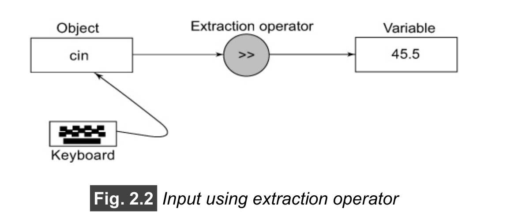
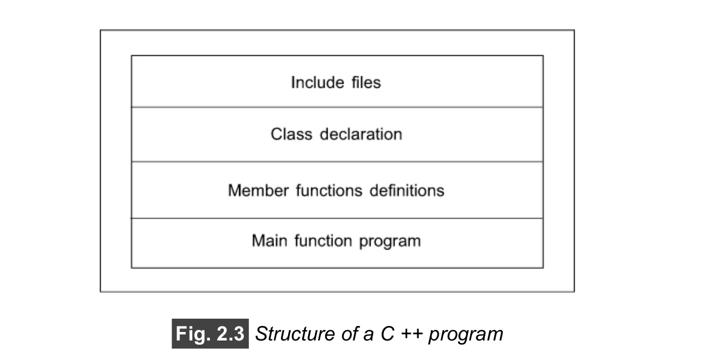
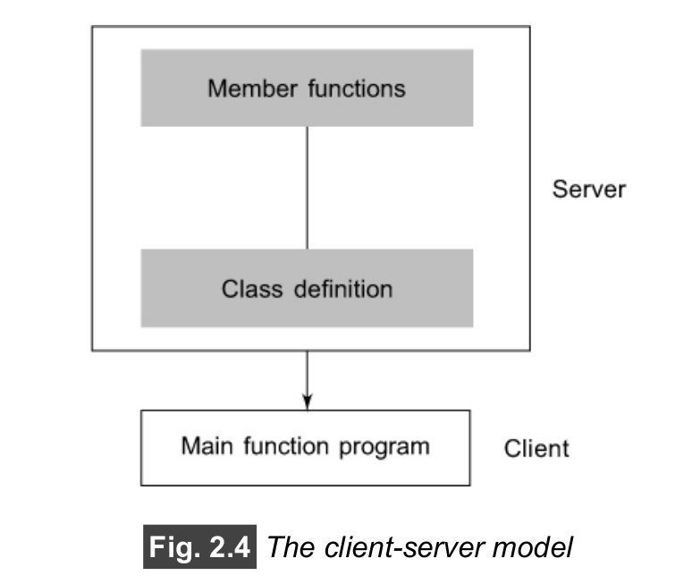

<!-- ______________________________________________________Chapter-01 Starts here_________________________________________________ -->
# <mark>Chapter - 01

> # Principles of Object-Oriented Programming
>
> <br>

## **Facts:**

<mark>In case of function oriented programming the main focus on the function or action</mark>,but in Object-oriented programming the main focus is on the objects/ real-life entity.

## Some of the quality issues that must be considered for critical evaluation are:

1. Correctness
2. Maintainability
3. Reusability
4. Openness and interoperability
5. Portability
6. Security
7. Integrity
8. User friendliness

## Some characteristics exhibited by procedure-oriented programming are:

1. Emphasis is on doing things (algorithms).
2. Large programs are divided into smaller programs known as functions.(Top-down Approach)<mark> The biggest drawback of Top-down Approach is that the code becomes less reuseable because in terms of a bottom-up approach the smaller problems that we solve can be use in other places that makes our system more reuseable which is not in case of top-down approach.

3. Most of the functions share global data.<mark>Global data are more vulnerable to an inadvertent change by a function.

4. Data move openly around the system from function to function.
5. Functions transform data from one form to another.
6. Employs top-down approach in program design.

# Some of the striking features of object-oriented programming are:

    • Emphasis is on data/Object rather than procedure.
    • Programs are divided into what are known as objects.
    • Data structures are designed such that they characterize the objects.
    • Functions that operate on the data of an object are tied together in the data structure.
    • Data is hidden and cannot be accessed by external functions.
    • Objects may communicate with each other through functions.
    • New data and functions can be easily added whenever necessary.
    • Follows bottom-up approach in program design.(Reusability)

## some of the concepts used extensively in object-oriented programming:

1. Objects
2. Classes
3. Data abstraction and encapsulation
4. Inheritance
5. Polymorphism
6. Dynamic binding
7. Message passing

> ### Objects :
>
> Objects are the basic run-time entities in an object-oriented system.
> They may represent a person, a place, a bank account, a table of
> data or any item that the program has to handle.<mark>Objects can
> interact without having to know details of each other’s data or code.

> ### Classes :
>
> Objects contain data, and code to manipulate
> that data. The entire set of data and code of an object can be made a
> user-defined data type with the help of a class. In fact, <mark>objects are
> variables of the type class.</mark>
> Once a class has been defined, we can
> create any number of objects belonging to that class. Each object is
> associated with the data of type class with which they are created.<mark> A class is thus a collection of objects of similar type.Classes are
> user-defined data types and behave like the built-in types of a programming language.

> ### Data Encapsulation :
>
> <mark>The wrapping up of data and functions into a single unit (called class)
> is known as encapsulation.</mark> Data encapsulation is the most striking
> feature of a class. The data is not accessible to the outside world,
> and only those functions which are wrapped in the class can access
> it.<mark> This insulation of the data from direct access by the
> program is called data hiding or information hiding.

> ### Data Abstraction :
>
> <mark> Abstraction refers to the act of representing essential features
> without including the background details or explanations.
> <br></mark>

Since the classes use the concept of data abstraction, they are
known as Abstract Data Types (ADT).

> ### Inheritance :
>
> <mark>Inheritance is the process by which objects of one class acquire the
> properties of objects of another class.</mark> It supports the concept of hierarchical classification.The principle
> behind this sort of division is that each derived class shares common
> characteristics with the class from which it is derived.
> <br> <mark>In OOP, the concept of inheritance provides the idea of reusability.</mark>
> This means that we can add additional features to an existing class
> without modifying it. This is possible by deriving a new class from the
> existing one. The new class will have the combined features of both
> the classes. The real appeal and power of the inheritance mechanism
> is that it allows the programmer to reuse a class that is almost, but not exactly, what he wants, and to tailor the class in such a way that it
> does not introduce any undesirable side-effects into the rest of the
> classes.

> ### Polymorphism :
>
> Polymorphism is another important OOP concept. Polymorphism, a
> Greek term,<mark> means the ability to take more than one form.</mark> An
> operation may exhibit different behaviours in different instances. The
> behaviour depends upon the types of data used in the operation. For
> example, consider the operation of addition. For two numbers, the
> operation will generate a sum. If the operands are strings, then the
> operation would produce a third string by concatenation.<mark> The process
> of making an operator to exhibit different behaviours in different
> instances is known as operator overloading.Using a single function name to
> perform different types of tasks is known as function overloading.</mark>
> Polymorphism plays an important role in allowing objects having
> different internal structures to share the same external interface. This
> means that a general class of operations may be accessed in the
> same manner even though specific actions associated with each
> operation may differ.<mark> Polymorphism is extensively used in
> implementing inheritance.

> ### Dynamic Binding :
>
> Binding refers to the linking of a procedure call to the code to be
> executed in response to the call. Dynamic binding (also known as late
> binding) means that the code associated with a given procedure call
> is not known until the time of the call at run-time. It is associated with
> polymorphism and inheritance.

> ### Message Passing :
>
> An object-oriented program consists of a set of objects that
> communicate with each other. The process of programming in an
> object-oriented language, therefore, involves the following basic
> steps:

1. Creating classes that define objects and their behaviour,
2. Creating objects from class definitions, and
3. Establishing communication among objects.
   <br>

Objects communicate with one another by sending and receiving
information much the same way as people pass messages to one
another. The concept of message passing makes it easier to talk
about building systems that directly model or simulate their real-world
counterparts.
<mark>A message for an object is a request for execution of a procedure,
and therefore will invoke a function (procedure) in the receiving object
that generates the desired result.</mark> Message passing involves
specifying the name of the object, the name of the function
(message) and the information to be sent.

Objects have a life cycle. They can be created and destroyed.
Communication with an object is feasible as long as it is alive.
<br><br>

> # Benefits of OOP :
>
> OOP offers several benefits to both the program designer and the
> user. Object-orientation contributes to the solution of many problems
> associated with the development and quality of software products.
> <mark>The new technology promises greater programmer productivity, betterquality of software and lesser maintenance cost. The principal
> advantages are:

1. Through inheritance, we can <mark>eliminate redundant code and
   extend the use of existing classes.
2. We can build programs from the standard working modules that
   communicate with one another, rather than having to start writing
   the code from scratch. This leads to <mark>saving of development time
   and higher productivity.
3. The principle of<mark> data hiding helps the programmer to build secure
   programs </mark>that cannot be invaded by code in other parts of the
   program.
4. It is possible to <mark>have multiple instances of an object to co-exist
   without any interference.</mark>
5. It is possible to map objects in the problem domain to those in the
   program.
6. It is <mark>easy to partition the work in a project based on objects</mark>.
7. The <mark>data-centered design approach enables us to capture more
   details of a model in imple-mentable form.
8. Object-oriented systems <mark>can be easily upgraded from small to
   large systems.
9. <mark>Message passing techniques for communication between objects
   makes the interface descriptions with external systems much
   simpler.
10. <mark> Software complexity can be easily managed.

> ## Object-Oriented Languages :

The languages should support several of the OOP concepts to
claim that they are object-oriented. Depending upon the features they
support, they can be classified into the following two categories:

1. Object-based programming languages, and
2. Object-oriented programming languages.

Object-based programming is the style of programming that
primarily supports encapsulation and object identity. Major features
that are required for object-based programming are:

1. Data encapsulation
2. Data hiding and access mechanisms
3. Automatic initialization and clear-up of objects
4. Operator overloading

Languages that support programming with objects are said to be
object-based programming languages.<mark> They do not support
inheritance and dynamic binding. Ada is a typical object-based
programming language.</mark>

> <mark> OOP = Object-based features + inheritance + dynamic binding

> ## Applications of OOP :
>
> The promising areas for application of OOP
> include:

1. Real-time systems
2. Simulation and modeling
3. Object-oriented databases
4. Hypertext, hypermedia and expertext
5. AI and expert systems
6. Neural networks and parallel programming
7. Decision support and office automation systems
8. CIM/CAM/CAD systems

The richness of OOP environment has enabled the software
industry to improve not only the quality of software systems but also
its productivity. Object-oriented technology is certainly changing the
way the software engineers think, analyze, design and implement
systems.

<br>
<br>
<br>

<!-- ______________________________________________________Chapter-02 Starts here_________________________________________________ -->
# <mark>Chapter - 02

> # Beginning with C++

## What is C++?

C++ is an object-oriented programming language. It was developed
by <mark> Bjarne Stroustrup</mark> at AT&T Bell Laboratories.
Stroustrup initially called the new language <mark>‘C with classes’. The idea of C++ comes
from the C increment operator ++. C++ is a superset of C.</mark>

The most important facilities that C++ adds on to C are<mark> classes,
inheritance, function overloading, and operator overloading.</mark> These
features enable creation of abstract data types, inherit properties from
existing data types and support polymorphism, thereby making C++ a
truly object-oriented language.

> ## Applications of C++ :
>
> C++ is a versatile language for handling very large programs. It is
> suitable for virtually any programming task including development of
> editors, compilers, databases, communication systems and any
> complex real-life application systems.

1. Since C++ allows us to create hierarchy-related objects, we can
   build special object-oriented libraries which<mark> can be used later by
   many programmers.
2. While C++ is<mark> able to map the real-world problem properly</mark>, the C
   part of C++ gives the language the ability to get close to the
   machine-level details.
3. C++ programs are<mark> easily maintainable and expandable</mark>. When a
   new feature needs to be implemented, it is very easy to add to
   the existing structure of an object.
4. It is expected that<mark> C++ will replace C as a general-purpose
   language in the near future.

<br>
<br>

> ## A Simple C++ Program :

> ### Printing something :
>
> <br>

```cpp
#include<iostream>
using namespace std;

int main()
{
    cout << "C++ is an Object-Oriented Language" << endl;
    return 0;
}
```

<br>
The above
example contains only one function, main(). As usual, execution
begins at main().<mark> Every C++ program must have a main(). C++ is a
free-form language.</mark>

<br>

> ## Comments :

```cpp
#include<iostream>
using namespace std;

int main()
{

//This is Single-line Comment

/*This
   is
      Multi-line
         Comment
*/
}
```

> ### Output Operator :

```cpp
#include<iostream>
using namespace std;

int main()
{

   cout << "C++ is better than C." << endl;

}
```

<br>
<br>


<br>
<br>

The operator << is the bit-wise left-shift operator
and it can still be used for this purpose. This is an example of how
one operator can be used for different purposes, depending on the
context. This concept is known as operator overloading, an important
aspect of polymorphism.

<br>
<br>

> ## The iostream File :

```cpp
#include<iostream>
```

The header file iostream should be included at the beginning of all
programs that use input/output statements.

Apart from #include, the other pre-processor directives such as
#define, #error, etc.

> ## Namespace :
>
> This defines a scope for the identifiers that are used in a
> program.

```cpp
using namespace std;
```

std is the namespace where ANSI C++ standard class
libraries are defined. All ANSI C++ programs must include this
directive. This will bring all the identifiers defined in std to the current
global scope. using and namespace are the new keywords of C++.

> ## Average of Two Numbers :

```cpp
#include<iostream>
using namespace std;

int main()
{
    float num1, num2, sum, avg;

    cout << "Enter the first number : ";
    cin >> num1;

    cout << "Enter the second number : ";
    cin >> num2;

    sum = num1 + num2;
    avg = sum / 2;

    cout << "The average is : " << avg << endl;
}
```

<br>
<br>

> ## Variables :

```cpp
 float num1, num2, sum, avg;
```

> ## Input Operator :

```cpp
cin >> num1;
cin >> num2;
```

The operator >> is known as<mark> extraction or get from operator </mark>. It
extracts (or takes) the value from the keyboard and assigns it to the
variable on its right
<br>
<br>



<br>
<br>

> ## Cascading of I/O Operators :

```cpp
cout << "The average is : " << avg << endl;
```

> Note : cin can read only one word and therefore we cannot
> use names with blank spaces.

> ## Structure of C++ Program :


<br>

<br>
<br>

> ## NOTE : A typical C++ program would contain four basic sections, namely, include files section, class declaration section, member function section and main function section.

<br>
<br>

<!-- ______________________________________________________Chapter-05 Starts here_________________________________________________ -->
# <mark> Chapter - 05
> # Classes and Objects

## **Introduction**

The most important feature of C++ is the “class”. Stroustrup initially gave the name <mark>“C with
classes”.</mark>

## **C Structures Revisited**

We know that one of the unique features of the C language is
structures.<mark> They provide a method for packing together data of
different types.</mark> A structure is a convenient tool for handling a group
of logically related data items. It is a user-defined data type with a
template that serves to define its data properties. Once the structure
type has been defined, we can create variables of that type using
declarations that are similar to the built-in type declarations.

**Syntax:**

```c
struct student
{
char name[20];
int roll_number;
float total_marks;
};
```

```c
struct student A; // C declaration
```

Member variables can be accessed using
the dot or period operator as follows:

```c
strcpy(A.name, “John”);
A.roll_number = 999;
A.total_marks = 595.5;
Final_total = A.total_marks + 5;
```

## **Limitations of C Structure**

1. <mark>Standard C does not allow the struct data type to be treated like
   built-in types.</mark> For example, consider the following structure:

```c
struct complex
{
float x;
float y;
};
struct complex cl, c2, c3;
```

The complex numbers c1, c 2, and c 3 can easily be assigned
values using the dot operator, but we <mark>cannot add two complex
numbers or subtract</mark> one from the other. For example,

```c
c3 = cl + c2;
```

is <mark>illegal in C</mark>

2.  Another important limitation of C structures is that they<mark> do not permit data hiding.</mark> Structure members can be directly accessed by
    the structure variables by any function anywhere in their scope. In
    other words,<mark> the structure members are public.</mark>

## **Extensions to Structures**

- C++ attempts to bring the user-defined types as <mark>close as possible to the built-in data types</mark> and also <mark>provides a facility to hide the data</mark> which
  is one of the main principles of OOP.<mark> Inheritance, a mechanism by
  which one type can inherit characteristics from other types</mark>, is also
  supported by C++.

- <mark>In C++, a structure can have both variables and functions as
  members</mark>. It can also <mark>declare some of its members as ‘private’ so
  that they cannot be accessed directly by external functions</mark>.

- In C++, the structure names are stand-alone and can be used like
  any other type name. In other words,<mark> the keyword struct can be
  omitted in the declaration of structure variables.</mark>

```c
student A; // C++ declaration
```

Remember, this is an error in C.

C++ incorporates all these extensions in another user-defined type
known as class. There are very few syntactical differences between structures and classes in C++ and, therefore,<mark> they can be used
interchangeably with minor modifications.</mark> Since the class is a specially
introduced data type in C++, <mark>most of the C++ programmers tend to
use the structures for holding only data, and classes to hold both the
data and functions.</mark>

**NOTE:**

    The only difference between a structure and a class in C++ is that, by default, the members of a class are private, while, by default, the members of a structure are public.

## **Specifying a Class**

<mark>A class is a way to bind the data and its associated functions
together.</mark> It <mark>allows the data (and functions) to be hidden,</mark> if necessary,
from external use. When defining a class, we are creating a new
abstract data type that can be treated like any other built-in data type. Generally, a class specification has two parts:

1. Class declaration
2. Class function definitions

**The general form of a class declaration is:**

```c++
class class_name
{
private:
    variable declarations;
    function declarations;
public:
    variable declarations;
    function declaration;
};
```

> > The body of a class is enclosed within braces and terminated by a semicolon.

<mark>Functions and variables are collectively called class members.</mark> The keywords <mark>private and public are known as visibility labels</mark>. Note that these keywords are followed by a colon. The class members that have been declared private can be accessed only from within the class. On the other hand, public members can be accessed from outside the class also.<mark> Data hiding (using private declaration) is the key feature of object-oriented programming. The use of the keyword private is optional. By default, the members of a class are private. </mark> If both the labels are missing, then, by default, all the members are private.

The variables declared inside the class are known as <mark>data
members </mark>and the functions are known as <mark>member functions</mark>. <mark>Only the member functions can have access to the private data of members and private functions.</mark>

```
The binding of data and functions together into a single class-type variable is referred to as encapsulation.
```


**Fig.** Data hiding in classes

> ## A Simple Class Example

```c++
class item
{
int number; // variables declaration
float cost; // private by default
public:
void getdata(int a, void b )// functions declaration
putdata(void); // using prototype
}; // ends with semicolon.
```

<mark>The data members are usually declared
as private and the member functions as public.</mark>

> ## Creating Objects

1. In C++, the class variables are known as objects.

2. We may also declare more than one object in one statement.

Example:
item x, y, z;

<mark>Note that class specification, like a structure, provides
only a template and does not create any memory space for the
objects.</mark>

> ## **Accessing Class Members**

General format for calling a member function :

```object-name.function-name (actual-arguments);

```

For example, the function call statement:

```c++
x.getdata(100,75.5);
x.putdata();
```

<br>

<mark>Objects communicate by sending and
receiving messages. This is achieved through the member functions.</mark>

<br>
NOTE: The use of data in this manner defeats the very idea
of data hiding and therefore should be avoided.

<br>

> ## Defining Member Functions

 <br>
 Member functions can be defined in two places:
• Outside the class definition.
<br>
• Inside the class definition.

<br>

> ### Outside the Class Definition

<br>
Member functions that are declared inside a class have to be defined separately outside the class.

<br>

An important difference between a member function and a normal function is that a member function incorporates a membership **‘identity label’** in the header. This ‘label’ tells the compiler which class the function belongs to.
<br> 
The general form of a member function definition is:

```
 return-type class-name :: function-name (argument declaration)
 {
 Function body
 }
```
<br>

<mark>The membership label class-name:: tells the compiler that the function function-name belongs to the class class-name.</mark>That is, the
scope of the function is restricted to the class-name specified in the
header line.

**The symbol :: is called the scope resolution operator.**
<br>

The member functions have some special characteristics that are often used in program development.

These characteristics are:
<mark>
<br><br>
• Several different classes can use the same function name. The
‘membership label’ will resolve their scope.
<br><br>
• Member functions can access the private data of the class. A nonmember function cannot do so. (However, an exception to this rule is a friend function discussed later.)
<br><br>
• A member function can call another member function directly, without using the dot operator.
</mark>

<br>

>### Inside the Class Definition

<br>

```c++
class item
{
int number;
float cost;
public:
void getdata(int a, float b); // declaration
// inline function
void putdata(void) // definition inside the class
{
cout << number << “\n”
cout << cost << “\n”
}
/*Inline is a request to the compiler (not a command)to make a function as an inline function, to reduce the overhead of function calling...Inline function call e time kom lage.... If compiler treat a function as a inline function it substitute the code of function in a single line. Inline function should contain a single instruction....
Example:
May, I come in sir?

Example code:

inline return_type function_name(){
       //single statement.
} 
*/

};
```

<br>

<mark>When a function is defined inside a class, it is treated as an inline function.</mark> When Therefore, all the restrictions and limitations that apply to an inline function are also applicable here. <mark>Normally, only small functions are defined inside the class definition.</mark>

<br>

>## DA C++ Program with Class
